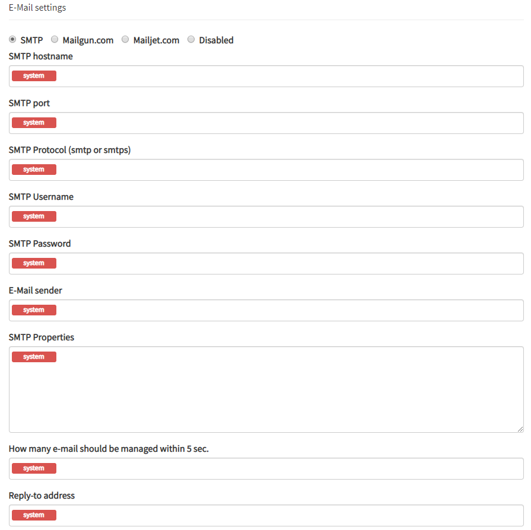
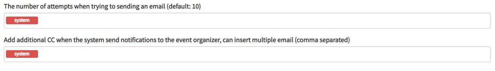

##Email

###SMTP

##### Hostname
You can find the SMTP hostnames of some common e-mail providers
[here](https://serversmtp.com/outgoing-mail-server-hostname/).
If you are going to have a large number of messages being sent it will
likely be better to get a professional SMTP server.

##### Port
Port 25 is the default for relaying messages. However, this is beginning to be 
restricted so you are probably better off using port 587. Port 2525 or
465 are other options if the above are blocked. If you are not sure which
port you can use check with your hosting service.

##### Protocol
Select whether you want to use smtp (simple mail transfer protocol)
or smtps (simple mail transfer protocol secure). SMTPS adds an 
additional layer of security at the transport layer, comparable to 
http and https.

##### Username and Password
These will be your username and password for your host server 
(whatever you use to log in).

##### E-mail sender
The email address you want to send from.

##### Properties

Here you can change any additional properties you want. More details
on what properties you can change, and the syntax for changing them
is [here](https://javaee.github.io/javamail/docs/api/com/sun/mail/smtp/package-summary.html).

------------------------------------------

###Additional options

Two extra options for all e-mail providers are the number of attempts at 
sending an email and an additional CC. The first is clear, and the second
provides a way to keep track of emails being sent out.