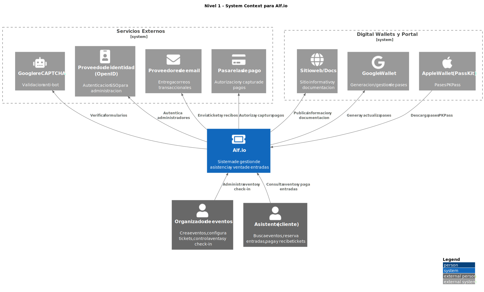
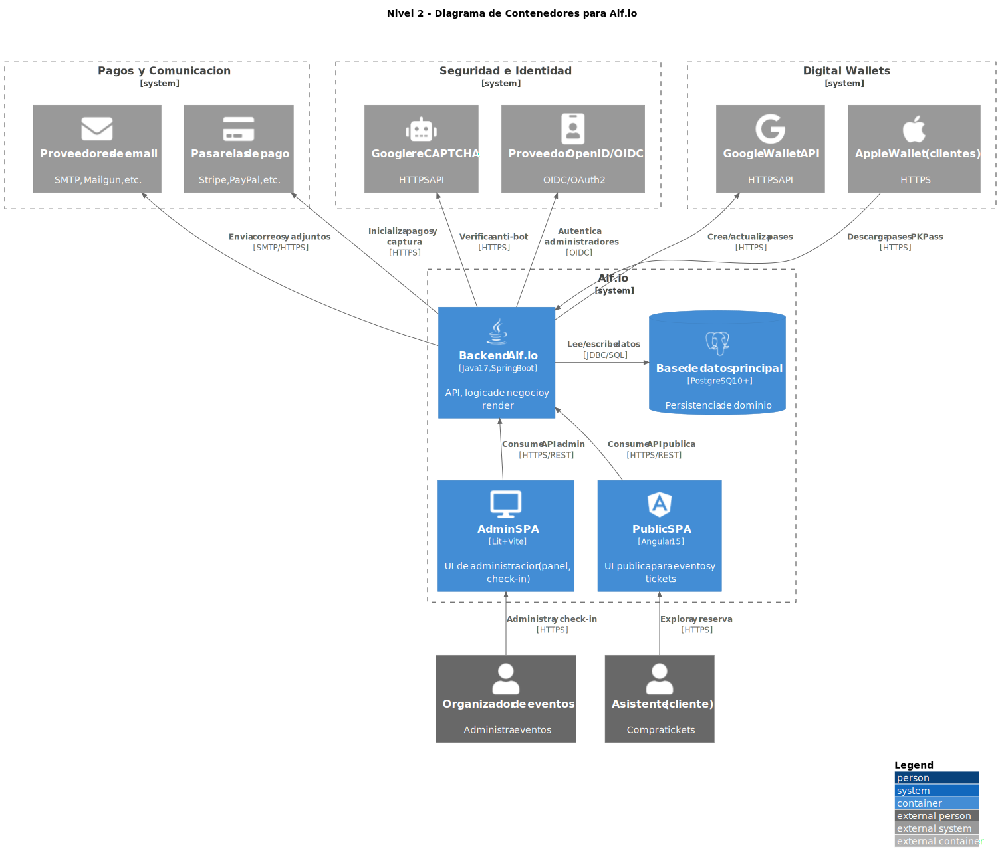
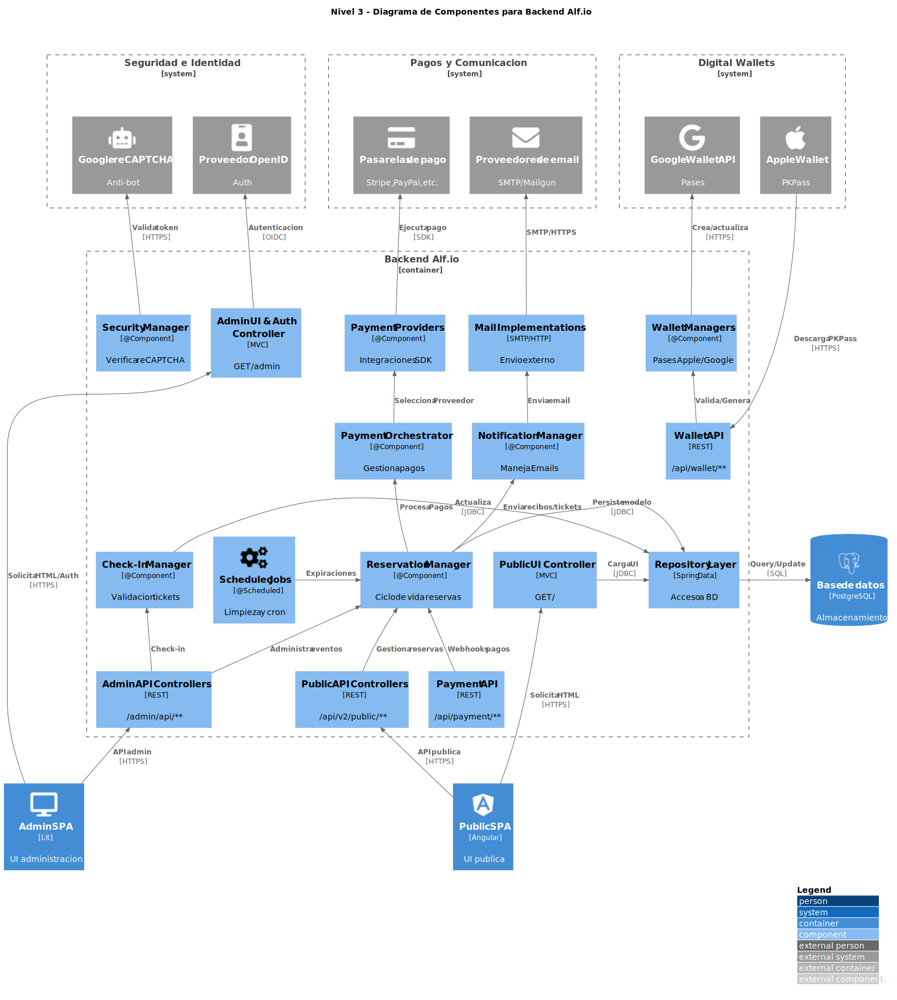

# Arquitectura C4

El sistema **Alf.io** utiliza el modelo de arquitectura C4 para documentar su diseño. Por razones de practicidad y alcance del proyecto, este modelado se ha desarrollado únicamente hasta el **Nivel 3 (Componentes)**.

## Nivel 1: Contexto del Sistema (System Context)

El diagrama de contexto muestra a los usuarios principales y los sistemas externos con los que Alf.io interactúa.




<details>
<summary>Ver Código PlantUML</summary>

```plantuml
@startuml
skinparam backgroundColor white
!include https://raw.githubusercontent.com/plantuml-stdlib/C4-PlantUML/master/C4_Context.puml

' Importación de librería de iconos FontAwesome5
!include <tupadr3/common>
!include <tupadr3/font-awesome-5/user>
!include <tupadr3/font-awesome-5/credit_card>
!include <tupadr3/font-awesome-5/envelope>
!include <tupadr3/font-awesome-5/id_badge>
!include <tupadr3/font-awesome-5/robot>
!include <tupadr3/font-awesome-5/google>
!include <tupadr3/font-awesome-5/apple>
!include <tupadr3/font-awesome-5/globe>
!include <tupadr3/font-awesome-5/ticket_alt>

LAYOUT_WITH_LEGEND()

title Nivel 1 - System Context para Alf.io

UpdateElementStyle("organizador", $bgColor="#E35F12", $fontColor="#FFFFFF", $borderColor="#B84405")
UpdateElementStyle("asistente", $bgColor="#E35F12", $fontColor="#FFFFFF", $borderColor="#B84405")

System_Boundary(b_servicios, "Servicios Externos") {
    System_Ext(pago, "Pasarelas de pago", "Autorizacion y captura de pagos", $sprite="credit_card")
    System_Ext(email, "Proveedores de email", "Entrega correos transaccionales", $sprite="envelope")
    System_Ext(sso, "Proveedor de identidad (OpenID)", "Autenticacion SSO para administracion", $sprite="id_badge")
    System_Ext(recaptcha, "Google reCAPTCHA", "Validacion anti-bot", $sprite="robot")
}

System_Boundary(b_wallets_site, "Digital Wallets y Portal") {
    System_Ext(gwallet, "Google Wallet", "Generacion/gestion de pases", $sprite="google")
    System_Ext(awallet, "Apple Wallet (PassKit)", "Pases PKPass", $sprite="apple")
    System_Ext(site, "Sitio web/Docs", "Sitio informativo y documentacion", $sprite="globe")
}

System(alfio, "Alf.io", "Sistema de gestion de asistencia y venta de entradas", $sprite="ticket_alt")

Person_Ext(organizador, "Organizador de eventos", "Crea eventos, configura tickets, controla ventas y check-in", $sprite="user")
Person_Ext(asistente, "Asistente (cliente)", "Busca eventos, reserva entradas, paga y recibe tickets", $sprite="user")

Rel_Up(organizador, alfio, "Administra eventos y check-in")
Rel_Up(asistente, alfio, "Consulta eventos y paga entradas")
Rel_Up(alfio, pago, "Autoriza y captura pagos")
Rel_Up(alfio, email, "Envia tickets y recibos")
Rel_Up(alfio, sso, "Autentica administradores")
Rel_Up(alfio, recaptcha, "Verifica formularios")
Rel_Up(alfio, gwallet, "Genera y actualiza pases")
Rel_Up(alfio, site, "Publica informacion y documentacion")
Rel_Down(awallet, alfio, "Descarga pases PKPass")

Lay_Right(b_servicios, b_wallets_site)
@enduml
```

</details>

## Nivel 2: Contenedores (Containers)

El diagrama de contenedores muestra las aplicaciones y bases de datos principales que componen el sistema Alf.io.



<details>
<summary>Ver Código PlantUML</summary>

```plantuml
@startuml
skinparam backgroundColor white
!include https://raw.githubusercontent.com/plantuml-stdlib/C4-PlantUML/master/C4_Container.puml

!include <tupadr3/common>
!include <tupadr3/font-awesome-5/user>
!include <tupadr3/font-awesome-5/credit_card>
!include <tupadr3/font-awesome-5/envelope>
!include <tupadr3/font-awesome-5/id_badge>
!include <tupadr3/font-awesome-5/robot>
!include <tupadr3/font-awesome-5/google>
!include <tupadr3/font-awesome-5/apple>
!include <tupadr3/font-awesome-5/desktop>
!include <tupadr3/devicons/angular>
!include <tupadr3/devicons/java>
!include <tupadr3/devicons/postgresql>

LAYOUT_WITH_LEGEND()

title Nivel 2 - Diagrama de Contenedores para Alf.io

UpdateElementStyle("organizador", $bgColor="#E35F12", $fontColor="#FFFFFF", $borderColor="#B84405")
UpdateElementStyle("asistente", $bgColor="#E35F12", $fontColor="#FFFFFF", $borderColor="#B84405")

System_Boundary(b_pagos_comms, "Pagos y Comunicacion") {
    System_Ext(pago, "Pasarelas de pago", "Stripe, PayPal, etc.", $sprite="credit_card")
    System_Ext(email, "Proveedores de email", "SMTP, Mailgun, etc.", $sprite="envelope")
}

System_Boundary(b_seguridad, "Seguridad e Identidad") {
    System_Ext(sso, "Proveedor OpenID/OIDC", "OIDC/OAuth2", $sprite="id_badge")
    System_Ext(recaptcha, "Google reCAPTCHA", "HTTPS API", $sprite="robot")
}

System_Boundary(b_wallets, "Digital Wallets") {
    System_Ext(gwallet, "Google Wallet API", "HTTPS API", $sprite="google")
    System_Ext(awallet, "Apple Wallet (clientes)", "HTTPS", $sprite="apple")
}

Lay_Right(b_pagos_comms, b_seguridad)
Lay_Right(b_seguridad, b_wallets)

System_Boundary(c1, "Alf.io") {
    Container(backend, "Backend Alf.io", "Java 17, Spring Boot", "API, logica de negocio y render", $sprite="java")
    ContainerDb(db, "Base de datos principal", "PostgreSQL 10+", "Persistencia de dominio", $sprite="postgresql")
    Container(spa_public, "Public SPA", "Angular 15", "UI publica para eventos y tickets", $sprite="angular")
    Container(spa_admin, "Admin SPA", "Lit + Vite", "UI de administracion (panel, check-in)", $sprite="desktop")
}

Person_Ext(organizador, "Organizador de eventos", "Administra eventos", $sprite="user")
Person_Ext(asistente, "Asistente (cliente)", "Compra tickets", $sprite="user")

Rel_Up(asistente, spa_public, "Explora y reserva", "HTTPS")
Rel_Up(organizador, spa_admin, "Administra y check-in", "HTTPS")
Rel_Up(spa_public, backend, "Consume API publica", "HTTPS/REST")
Rel_Up(spa_admin, backend, "Consume API admin", "HTTPS/REST")
Rel_Right(backend, db, "Lee/escribe datos", "JDBC/SQL")
Rel_Up(backend, pago, "Inicializa pagos y captura", "HTTPS")
Rel_Up(backend, email, "Envia correos y adjuntos", "SMTP/HTTPS")
Rel_Up(backend, sso, "Autentica administradores", "OIDC")
Rel_Up(backend, recaptcha, "Verifica anti-bot", "HTTPS")
Rel_Up(backend, gwallet, "Crea/actualiza pases", "HTTPS")
Rel_Down(awallet, backend, "Descarga pases PKPass", "HTTPS")
@enduml
```

</details>

## Nivel 3: Componentes (Components)

El diagrama de componentes hace zoom en el backend (Spring Boot) mostrando sus controladores, gestores de negocio y adaptadores.

<a href="images/l3.svg" target="_blank"></a>

<details>
<summary>Ver Código PlantUML</summary>

```plantuml
@startuml
skinparam backgroundColor white
!include https://raw.githubusercontent.com/plantuml-stdlib/C4-PlantUML/master/C4_Component.puml

!include <tupadr3/common>
!include <tupadr3/font-awesome-5/credit_card>
!include <tupadr3/font-awesome-5/envelope>
!include <tupadr3/font-awesome-5/id_badge>
!include <tupadr3/font-awesome-5/robot>
!include <tupadr3/font-awesome-5/google>
!include <tupadr3/font-awesome-5/apple>
!include <tupadr3/font-awesome-5/database>
!include <tupadr3/font-awesome-5/desktop>
!include <tupadr3/font-awesome-5/cogs>
!include <tupadr3/devicons/angular>
!include <tupadr3/devicons/java>
!include <tupadr3/devicons/postgresql>

LAYOUT_WITH_LEGEND()

title Nivel 3 - Diagrama de Componentes para Backend Alf.io

System_Boundary(b_pagos_comms, "Pagos y Comunicacion") {
    System_Ext(pago, "Pasarelas de pago", "Stripe, PayPal, etc.", $sprite="credit_card")
    System_Ext(email, "Proveedores de email", "SMTP/Mailgun", $sprite="envelope")
}

System_Boundary(b_seguridad, "Seguridad e Identidad") {
    System_Ext(sso, "Proveedor OpenID", "Auth", $sprite="id_badge")
    System_Ext(recaptcha, "Google reCAPTCHA", "Anti-bot", $sprite="robot")
}

System_Boundary(b_wallets, "Digital Wallets") {
    System_Ext(gwallet, "Google Wallet API", "Pases", $sprite="google")
    System_Ext(awallet, "Apple Wallet", "PKPass", $sprite="apple")
}

Lay_Right(b_pagos_comms, b_seguridad)
Lay_Right(b_seguridad, b_wallets)

Container_Boundary(backend, "Backend Alf.io") {
    Component(prov_pay, "Payment Providers", "@Component", "Integraciones SDK")
    Component(impl_mail, "Mail Implementations", "SMTP/HTTP", "Envio externo")
    Component(mgr_sec, "Security Manager", "@Component", "Verifica reCAPTCHA")
    Component(mgr_pay, "Payment Orchestrator", "@Component", "Gestiona pagos")
    Component(mgr_notif, "Notification Manager", "@Component", "Maneja Emails")
    Component(mgr_res, "Reservation Manager", "@Component", "Ciclo de vida reservas")
    Component(mgr_checkin, "Check-In Manager", "@Component", "Validacion tickets")
    Component(mgr_wallet, "Wallet Managers", "@Component", "Pases Apple/Google")
    Component(jobs, "Scheduled Jobs", "@Scheduled", "Limpieza y cron", $sprite="cogs")
    Component(ctrl_pub_ui, "Public UI Controller", "MVC", "GET /")
    Component(ctrl_pub_api, "Public API Controllers", "REST", "/api/v2/public/**")
    Component(ctrl_adm_ui, "Admin UI & Auth Controller", "MVC", "GET /admin")
    Component(ctrl_adm_api, "Admin API Controllers", "REST", "/admin/api/**")
    Component(ctrl_pay, "Payment API", "REST", "/api/payment/**")
    Component(ctrl_wallet, "Wallet API", "REST", "/api/wallet/**")
    Component(repo, "Repository Layer", "Spring Data", "Acceso a BD")
}

ContainerDb(db, "Base de datos", "PostgreSQL", "Almacenamiento", $sprite="postgresql")

Container(spa_public, "Public SPA", "Angular", "UI publica", $sprite="angular")
Container(spa_admin, "Admin SPA", "Lit", "UI administracion", $sprite="desktop")

Rel_Up(spa_public, ctrl_pub_ui, "Solicita HTML", "HTTPS")
Rel_Up(spa_public, ctrl_pub_api, "API publica", "HTTPS")
Rel_Up(spa_admin, ctrl_adm_ui, "Solicita HTML/Auth", "HTTPS")
Rel_Up(spa_admin, ctrl_adm_api, "API admin", "HTTPS")
Rel_Up(ctrl_pub_api, mgr_res, "Gestiona reservas")
Rel_Up(ctrl_adm_api, mgr_res, "Administra eventos")
Rel_Up(ctrl_adm_api, mgr_checkin, "Check-in")
Rel_Up(ctrl_pay, mgr_res, "Webhooks pagos")
Rel_Up(ctrl_wallet, mgr_wallet, "Valida/Genera")
Rel_Right(jobs, mgr_res, "Expiraciones")
Rel_Up(ctrl_adm_ui, sso, "Autenticacion", "OIDC")
Rel_Up(mgr_sec, recaptcha, "Valida token", "HTTPS")
Rel_Up(mgr_res, mgr_pay, "Procesa Pagos")
Rel_Up(mgr_pay, prov_pay, "Selecciona Proveedor")
Rel_Up(prov_pay, pago, "Ejecuta pago", "SDK")
Rel_Up(mgr_res, mgr_notif, "Envia recibos/tickets")
Rel_Up(mgr_notif, impl_mail, "Envia email")
Rel_Up(impl_mail, email, "SMTP/HTTPS")
Rel_Up(mgr_wallet, gwallet, "Crea/actualiza", "HTTPS")
Rel_Down(awallet, ctrl_wallet, "Descarga PKPass", "HTTPS")
Rel_Right(ctrl_pub_ui, repo, "Carga UI", "JDBC")
Rel_Right(mgr_checkin, repo, "Actualiza", "JDBC")
Rel_Right(mgr_res, repo, "Persiste modelo", "JDBC")
Rel_Right(repo, db, "Query/Update", "SQL")
@enduml
```

</details>